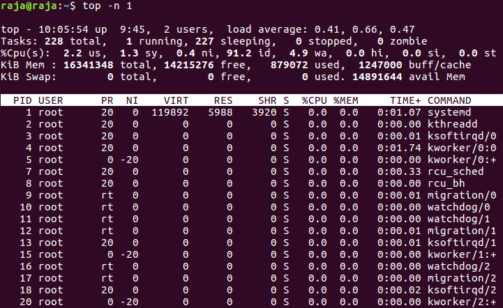
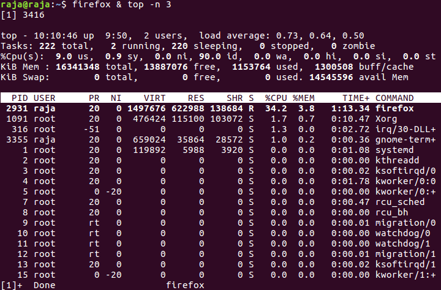

# Observations Lab 0 
---
### Question 1
  * Added 1.c which prints address of a variable and enters into a long loop.
  * Then ran 4 processes of the executable using `./a.out;./a.out;./a.out;./a.out`
  * Observation was that all addresses were not the same.
  * `0x7ffcc91d0a9c` `0x7ffd8e0f16bc` `0x7ffe8392a00c` `0x7fff95a7000c` was one of the output printed on to the screen.

### Question 2
 * Entered the top command in terminal at opening observed there were 228 running processes. The top command shows the stats of all processes running in the system. 
 
 * I entered a command `firefox & top -n 3` and with this the firefox opened and top started simultaneousely. 
 
