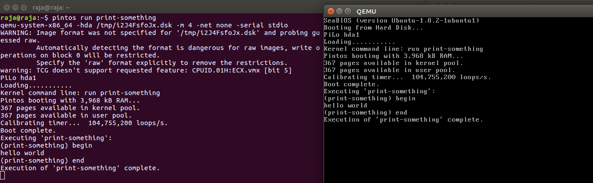
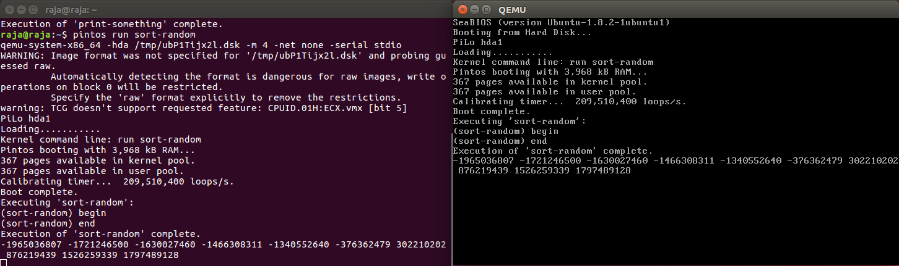

# Lab 5
-----
### Part 1
* Build and compiled
* test case alarm-multiple ran sucessfully
* print-something test case made source is `print-something.c` and entry point is `test_print-something` 

### Part 2
* Created thread which sorts a random array of integers using `thread_create()` all which can be observed in the self documented code in the source file `sort-random`.
* 
* Used List API to store and sort random values.

