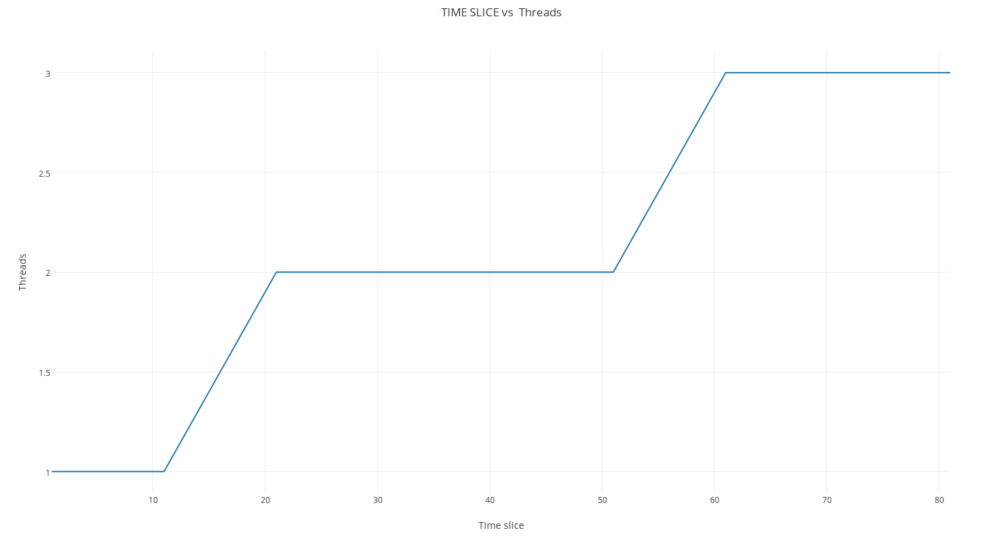
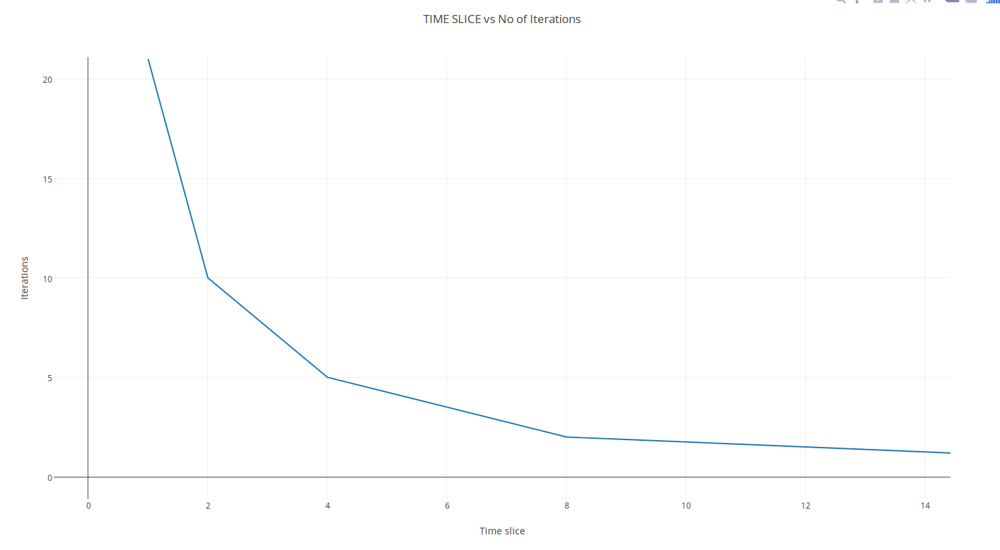

# Observations
------
### Part 1
* Removed `timer_sleep()` and put `thread_yield()` in sort-random.c in src/tests/threads.
* Now the main thread waits for the child thread to finish execution.
* If at all in the main thread we dont want to add this `thread_yield()`. We can modify src/threads/thread.c and call `thread_yield()` in `thread_unblock()`. This makes the parent process to wait untill all the child processes have completed execution.

### Part 2
* Firstly, My laptop is really fast if I simply print some numbers that simply won't take enough time for a context switch. So in src/tests/threads/thread-test.c I have a test function called `test_thread_sort` which can be called using `$ pintos run thread-sort` which also has some delay due to the fact that sorting takes lots of time.
* Ran it just like that. The output of sort wasn't correct as the sorting process wasn't completed. This was dues to RR scheduler.
* To convert RR to FCFS I increased the value of `TIME_SLICE` to about 1000. Theoretically infinity is the best value but in my case 1000 worked like a charm.

**Predictions** - When the time slice is small the number of threads that can in one quanta is low. But when it increases the process finishes before the quanta and thus more than one process can happen.

**Predictions** - When the quanta is low the number of iterations increases as iterations is noting but _context_switches/number_of_threads_. And if the iterations increases in equal proportions with slice.

*Special Mention* - I asked a question in piaaza to clarify my doubt on what iterations and threads actually are so help was taken from that website. Graphs were generated from data taken from output printed by a code which I made in src/tests/threads/thread-test.c which can be called using `$ pintos run thread-test`. 

Extra edits were made in thread.c
* Created an extra global variable `raja_ticks_counter` which counted context switches.
* Edited `thread_print_stats()` to print more valuable inforamation.

### Round Robin 
In pintos round robin works by maintaining a list of all processes. And a function `scheduler()` does the scheduling. It does the context switch. more implementation of switch is in `switch.S` which is assembly code. With the time slice the number of context switches decrease too. Scheduler takes the next process from the start of the list. And pushes the current process to the end. This is a brief explaination of how it works.

